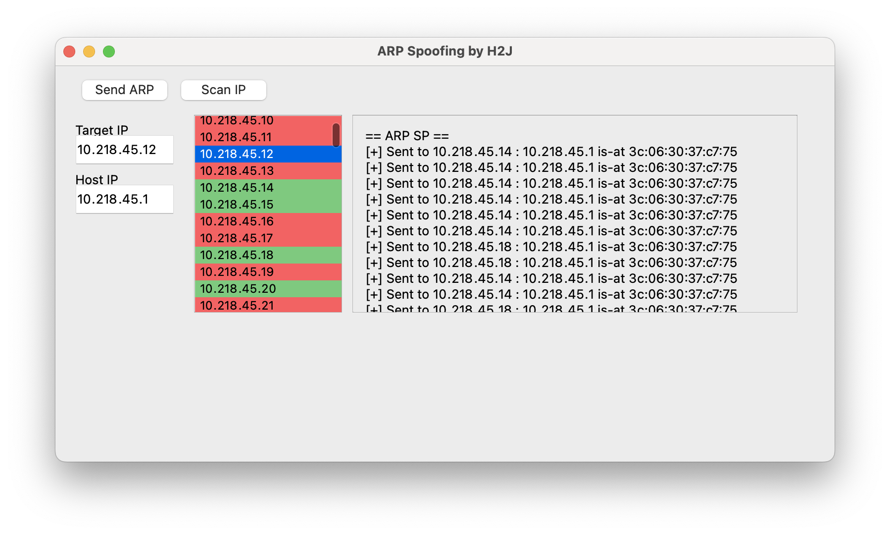

# automate-arp-spoofing
Python-based ARP spoofing project that can operate reliably

# WARNING: This project are for research purposes only

All legal responsibility rests with the individual or organization using this project. 

연구 목적으로만 사용 가능한 레포지토리 입니다. 모든 법적 책임은 이 프로젝트를 사용하는 개인 또는 단체에 있습니다. 명시된 사용 범위를 넘어 부정한 목적으로 사용하신다면 대한민국 법령 정보통신망이용촉진및정보보호등에관한법률 제 48조 3항에 따라 처벌받을 수 있습니다.

## 프로젝트 소개

이 프로젝트는 ARP 패킷을 보내 상대방 IP의 인터넷 접속을 방해하는 프로젝트입니다. 

* 내부망 IP 검색 기능
* ARP 차단 기능
* 내 내부 IP 자동 기입 기능

## 프로젝트 개발 동기

NetCut이라는 소프트웨어가 있습니다. 이것도 마찬가지로 인터넷 접속을 방해하는 소프트웨어인데, 부분적으로 유료화 되어있습니다. 더 많은 인터넷 사용자를 차단하기 위해서는 비용을 지불해야 합니다. 이 부분을 해결하고자 오픈소스로 개발했습니다. 

## 관련 게시글

https://velog.io/@dipokalhhj/Python%EC%9C%BC%EB%A1%9C-ARP-Spoofing-%ED%94%84%EB%A1%9C%EA%B7%B8%EB%9E%A8%EC%9D%84-%EB%A7%8C%EB%93%A4%EC%96%B4%EB%B3%B4%EC%9E%90